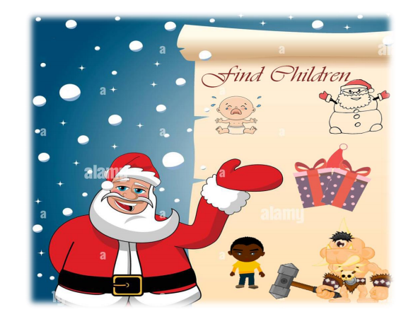

# 
 Find Children 

  

# Lista de figuras
- Personagem principal (Ana)
- Personagem secundaria (Papai Noel) 
- Crianças
- Inimigos
- Cenário selva 
- Cenário neve
- Casa do papai Noel
- Cenário parede de cimento

# Sumário
* [Introdução](#introdução)
* [Resumo da historia](#resumo-da-historia)
* [Gameplay overview](#gameplay-overview)
* [Gênero, semelhanças e diferenças](#gênero-semelhanças-e-diferenças) 
* [Público alvo](#público-alvo)
* [Atrativos do jogo](#atrativos-do-jogo) 
* [Fluxo do jogo](#fluxo-do-jogo) 
* [Interface e interação](#interface-e-interação) 
* [Mecânica do jogo](#mecânica-do-jogo) 
* [Mecânica básica](#mecânica-básica) 
* [Ataques](#ataques) 
* [Ataques físicos](#ataques-físicos) 
* [Vida](#vida) 
* [Progressão do jogo](#progressão-do-jogo) 
* [Condições de vitória](#condições-de-vitória) 
* [Detalhamento técnico](#detalhamento-técnico) 
* [Personagens](#personagens)
* [Animações](#animações) 
* [Som](#som) 
* [Efeitos sonoros](#efeitos-sonoros) 
* [Músicas](#músicas) 
* [Referência bibliográfica](#referência-bibliográfica) 

## Introdução
Este documento tem o intuito de demonstrar aspectos técnicos, artísticos
e narrativos do jogo “O Find Children”. Este documento apresenta o enredo do
jogo, a mecânica de jogo, seu objetivo, aspectos de jogabilidade e ferramentas
de desenvolvimento.
Com estes pontos é possível dar sequência ao processo de produção e
desenvolvimento do jogo.

## Resumo da historia
Depois de várias missões feita pela super-heroína Ana, uma das
missões não acaba bem infelizmente, ela é roubada todos seus poderes. E
desde então ela só apreciava os crimes acontecendo na sociedade, sem
ninguém para os impedir.
Quando chega as quadras festivas as crianças começam a desaparecer,
sem explicação. Então surgiu o papai Noel com uma proposta. Para a Ana
recuperar os seus poderes e voltar a lutar contra os crimes da sociedade, deram
lhe uma missão; ela terá que encontrar todas crianças desaparecidas e lhes levar
até ao papai Noel.

## Gameplay overview
Os animais e bonecos de neves têm como objetivo enfraquecer a Ana,
ela terá que se desviar de todos eles se quiser chegar até ao final. Cada fase
está separada por uma parede, e só será liberada se encontra as crianças de
cada fase. Fase 1 terá duas crianças, fase 2 e 3 terão 3 crianças cada, total são
8 crianças que ela terá que encontrar.
A última fase, a Ana se encontrara com o papai Noel para receber os
seus poderes, mas só vai conseguir o que ela almeja se encontrar todas crianças
perdidas.

## Gênero, semelhanças e diferenças
É um jogo do estilo aventura e ação, ambientado em um cenário aberto
com vários degraus e animais.
O jogo possui semelhanças com o Sonic. O diferencial do jogo, que
garante sua originalidade, é o seu objetivo, o estilo cômico empregado na arte e
efeitos sonoros.

## Público alvo
O jogo destina-se a jogadores com faixa etária ampla, desde
adolescentes até adultos, que não são jogadores de videogames e que estão à
procura de momentos de diversão em uma partida solo.

## Atrativos do jogo
É um jogo atrativo visualmente e interativo, pois possui jogabilidade
abrangente. Além de ser um jogo dinâmico e colorido com animações muito bem
trabalhadas, apresentadas durante a transição das fases, aproximando o jogador
da história do jogo, revelando novas informações e fatos a medida que cada
percurso é concluído, fazendo com que a expectativa em jogar seja ainda maior.
Tem personagens com um grande apelo carismático, cenários diferentes
a cada fase.

## Fluxo do jogo
O fluxo do jogo é baseado no percurso em que a Ana deve percorrer até
o encontro de cada criança no final de cada fase. Durante esse percurso, além
de encontrar as crianças, o jogador terá de enfrentar obstáculos no cenário. Ao
encontrar todas as crianças, no final da fase é mostrado todas as crianças salvas
e uma opção para reiniciar o jogo.

## Interface e interação
Nesse tópico estão descritos quais serão os dispositivos de entrada e
saída que serão usados pelo jogo.
- Entradas
O jogo utilizará o teclado como entrada do controle.
- Teclado
Com os comandos do teclado é possível movimentar a personagem ao
longo do percurso.
Durante o percurso da fase, a personagem se movimentara em todas
direções para se esquivar dos obstáculos.
- Movimentos da personagem:
- A tecla “←” move a personagem para esquerda.
- A tecla “→” move a personagem para direita.
- A tecla “↑” move a personagem para cima.
- A tecla “↓” move a personagem para baixo.
- Teclas de controle da interface:
- A tecla “i” é utilizada para reiniciar o jogo.
- Saídas
- A saída é feita através de vídeo (monitor) e som (caixas de som
ou fones de ouvido).

## Mecânica do jogo
Será abordado aspectos da mecânica do jogo, descrevendo o
comportamento de inimigos e do cenário do jogo.

## Mecânica básica
O jogo tem como mecânica básica, animação das crianças e de alguns
inimigos além de conseguir moedas e brindes ao longo do percurso.

## Ataques
No jogo será definido como o ataque de toda a ação intencional realizada
pelos inimigos que provoque dano no jogador. Estas ações são subdividas em
dois tipos: ataques físicos e especiais. Por sua vez estes são detalhados nos
tópicos subsequentes.

## Ataques físicos
Estes ataques visam danificar os heróis através do contado físico. A
seguir são descritos os tipos de ataque físico de cada inimigo.
- Inimigos da primeira fase
- Coelho: tem a movimentação horizontal efeito sine.
- Gato: tem a movimentação vertical efeito sine.
- Panda: tem a movimentação angle efeito sine.
- Rato: É estático.
- Inimigos da segunda fase
- Boneco de neve hallowin: tem a movimentação horizontal efeito sine.
- Boneco de neve com vaçoura: tem a movimentação horizontal efeito sine.
- Boneco de neve com ave: tem a movimentação horizontal efeito sine.
- Boneco de neve com pá: tem a movimentação vertical efeito sine.
- Boneco de neve inclinado: tem a movimentação vertical efeito sine.
- Inimigos da terceira fase
- Boneco de neve com balde: tem a movimentação horizontal efeito sine.
- Bola de neve com auricular vermelho: tem a movimentação horizontal efeito sine.
- Leão: tem a movimentação size efeito sine.
- Hiena: tem a movimentação horizontal efeito sine.

## Vida
O jogador começará a fase com um saldo de três vidas, e durante a fase
haverá a possibilidade de coletar vidas extras. A cada morte, o jogador reiniciara
o jogo.

## Progressão do jogo
Na primeira fase o jogo começa com uma dificuldade menor e essa
dificuldade aumenta progressivamente ao longo da fase. Na segunda e terceira
a quantidade de inimigos e obstáculos será maior.

## Condições de vitória
Para passar de fase o jogador terá que completar as condições de cada
fase que é, encontrar crianças. Na última fase, após de achar todas crianças terá
que encontrar o papai Noel.

## Detalhamento técnico
Neste capítulo serão abordados aspectos técnicos relacionados a
equipamentos e ferramentas a ser utilizados no desenvolvimento do Jogo.
- Hardware
- Windows XP ou superior
- Processador 1Ghz
- Memória RAM mínima 1GB (para XP) e 2GB (para Vista e Seven)
- Placa de Vídeo 128Mb
- Teclado
- Som
- Monitor com resolução 1024x768 com 32 bits de cores
- Software
- São usadas as seguintes ferramentas:
- Adobe Photoshop
- Paint 3D

## Personagens
Os personagens do jogo são baseados em seres humanos, animais e
bonecos de neve.
O jogo contém um personagem principais, Ana, baseado em ser
humano, que será controlado pelo jogador para evitar o contato com inimigos e
encontrar as crianças ao longo do jogo.

Os cenários são baseados nas características de cada fase do jogo.
Segue abaixo imagens de referências para os cenários:

## Animações
O jogo é constituído de animação dos perdonagem, inimigos e outros
elementos do cenário são animados também.
As animações dos personagens, inimigos e alguns elementos do
cenário, são desenvolvidas no software photoshop, Paint 3D e exportadas no
formato “png e jpg” para o construnct.

## Som
O jogo terá trilhas sonoras e efeitos sonoros nas animações e ao
decorrer das fases. Cada brinde, colisão, inimigo, possui um som característico.
Cada fase possui uma trilha sonora e todos os sons terão o formato MP3.

## Efeitos sonoros
Efeitos sonoros serão adicionados por eventos específicos durante o
jogo. Serão compostos por sons curtos e devem ter suas intensidades
equalizadas para que não haja sons mais altos que outros.
Segue a lista com a descrição dos eventos que disparam os sons
específicos:
- Personagem principal:
- Som específico para moedas, vidas e brindes.
- Som de colisão entre objeto da fase.
- Som de colisão entre os inimigos.
- Som de colisão entre as crianças.

## Músicas
Durante o decorrer do jogo toca uma música motivadora, para que o
jogador se sinta confortável e com mais animo para continuar o jogo.

## Referência bibliográfica
* [cartoon funny sound](https://pt.pikbest.com/sound-effects/cartoon-funny-sound-effect-runningaway_500353.html)
* [pikbest](https://pt.pikbest.com/sound-effects/)
* [gdd](https://www.crieseusjogos.com.br/como-criar-um-gdd-game-design-documentmodelo-para-download/)
* [salamisound](https://www.salamisound.com/pt/)
* [yodot](https://www.yodot.com/pt/baixar/agradecer-voce-para-download-ypsdrw.html)